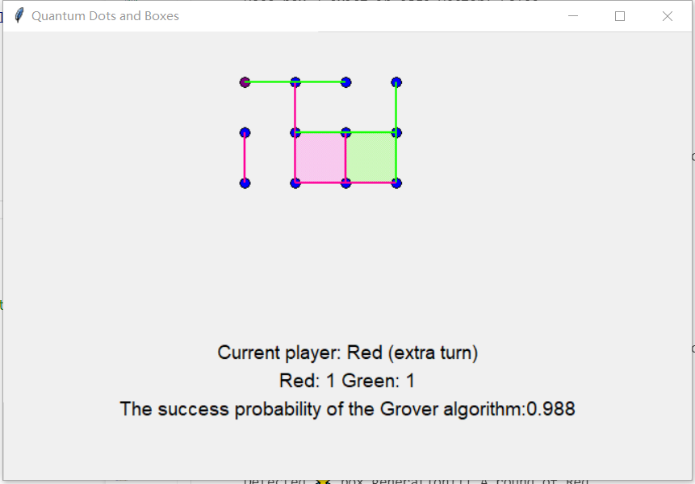
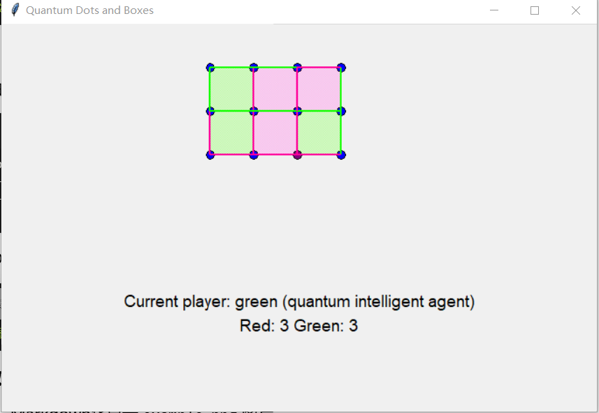

# [QPoland Global Quantum Hackathon 2024:](https://www.qaif.org/contests/qpoland-global-quantum-hackathon)

## Introduction
Quantum Games Track: Quantum Dots and Boxes

Dots and Boxes is a classic pencil-and-paper game that involves two players taking turns to draw a single horizontal or vertical line between two unjoined adjacent dots. The goal is to complete the boxes formed by the lines. 

Quantum Dots and Boxes is a battle between humans and programs, where the program uses the Grover search algorithm in quantum computing to find the best connection for each step. The main rule is that whoever forms the most boxes (scores) wins, and for each box formed, one more step is allowed.

YouTube link: 

Here is a screenshot of our game: where the red side represents humans and the green side represents programs:





## Team

Team name: Love Like Fire

Team menbers: [Jian-Fei Yang](https://github.com/YangD5014), [Gao-Ming Fan](https://github.com/Leonardo-F)

## Installation

Create a Conda environment and install the required packages:

```
conda create -n quantum_game_env python=3.11
conda activate quantum_game_env
pip install -r /path/to/requirements.txt

cd code
python DBGrover.py
```

## Document Description

`Quantum_Dots_and_Boxes_PPT.pptx`: The presentation of our project.

`DBGrover.py`: Run this file to start the game.

`DotsandBoxes.py`: Implementing Dots and Boxes games.

`game_replay.ipynb`: Realize replay of the previous game.

`Grover_tool.py`: Grover algorithm searches for the core code of each connection step.

`game_state.pkl`：Store the game process and the status of every step taken by both parties.

## The Further Work

- Realize a larger scale game board;
- Randomly determine players to play first and then;
- Perhaps we can try to construct a QUBO model for each step of the game and use QAOA or VQE algorithms to solve it;
